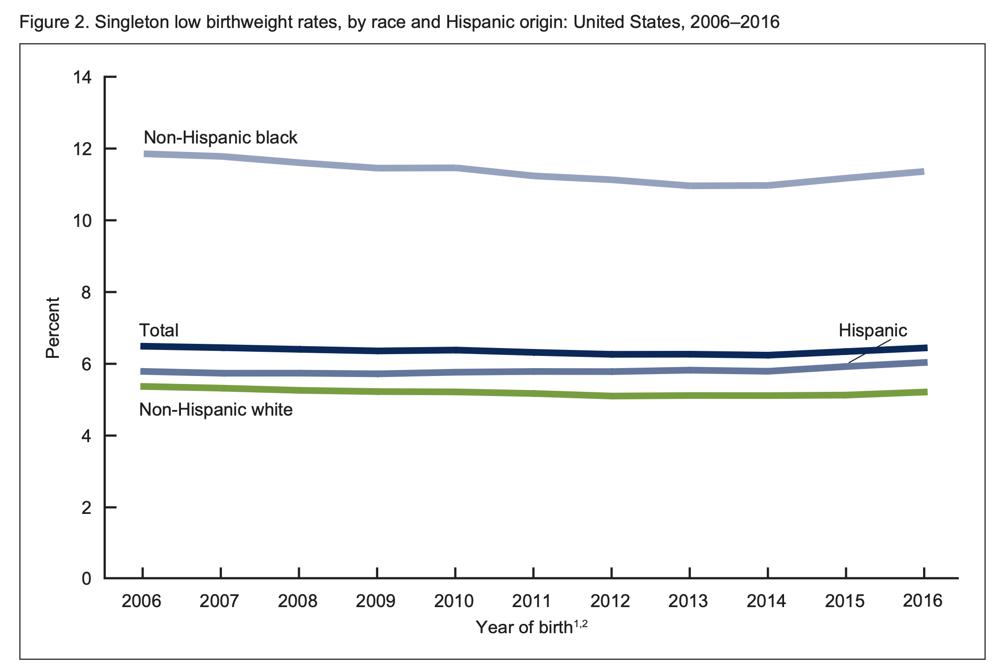
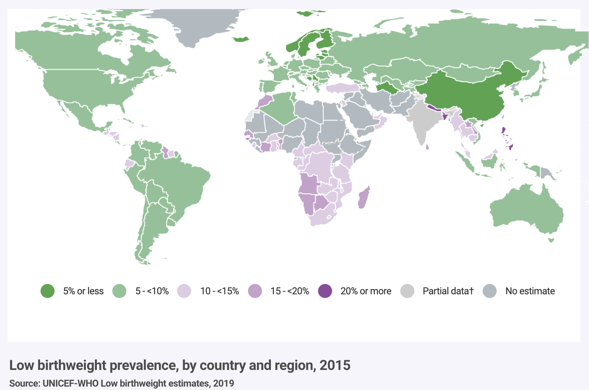

## Motivating example: Prenatal Care

Infant birth weight is the single most important factor affecting neonatal mortality. Children with lower birthweights are at increased risk of many medical problems later in life. Lower birthweights are associated with decreased disease resistance and increases in diseases such as asthma, rental failure, hypertension, diabetes, kidney development, hearing impairment, delays in motor and social development, and coronary disease.  Numerous studies have been conducted on risk factors for low birthweight in different populations. Many studies identify sociodemographic factors associated with the risk of low birthweight. Most likely a combination of biological, behavioral, environmental, and medical factors contribute to a baby’s birthweight.

The prevalence of low birthweight infants has been declining slowly in the United States over the last 4 decades, but is still a problem that persists here and globally. 

<center></center>

<center></center>

### First Steps
In 1989, Seattle and King County in Washington state began a program using state and federal funds to expand Medicaid for low-income women. The new program, called [First Steps](https://www.kingcounty.gov/depts/health/locations/health-insurance/coverage/eligibility/first-steps-insurance.aspx) provides free prenatal care to low-income women. Prenatal care includes both medical attention and advice about lifestyle decisions that may affect birthweight. The goal of First Steps is to improve birth outcomes, including increased birthweights in King County. Low birthweight is defined as a birthweight of < 2,500 grams. Very low birthweight is defined as a birthweight of < 1,500 grams.

You have been hired as a consultant by the board of public health in King County, and they have provided you with a random sample of all singleton births in King County in 2001. Your job is to investigate the question of whether participation in 'First Steps' increases birthweights.  

The data includes the following information for 2,500 infants and mothers:

* `gender`: the child’s sex
* `plural`: the multiplicity of the birth
* `age`: the mother’s age at birth
* `race`: the mother’s race
* `parity`: prior number of children in family
* `married`: was the mother married?
* `bwt`: birthweight (grams)
* `smokeN`: number of cigarettes per day during pregnancy
* `drinkN`: number of drinks per day during pregnancy
* `firstep`: indicates participation in First Steps
* `welfare`: indicates that mother was on welfare
* `smoker`: indicates maternal smoking during pregnancy
* `drinker`: indicates maternal alcohol use during pregnancy
* `wpre`: mother’s pre-pregnancy weight in pounds
* `wgain`: amount of maternal weight-gain during pregnancy
* `education`: years of mother’s education
* `gestation`: gestational age at birth (in weeks)

```{r, message=FALSE, warning=FALSE, echo=FALSE}
library(ggplot2)
library(dplyr)
```

```{r, message=FALSE, warning=FALSE, echo=FALSE}
data <- read.table("KingCounty2001_data.txt", header = TRUE)
head(data)
```

Of the 2,500 women who gave birth, 403 of them joined the First Steps program and 2,097 did not. 

```{r}
table(data$firstep)
```

Studies have shown that race, mother's smoking and drinking status, mother's age and gestation are all associated with birthweight. Let's explore our dataset a bit to see if these variables are also associated with birthweight in our sample.

```{r, message=FALSE, warning=FALSE}
p <- data %>% ggplot(aes(age, bwt)) +
              geom_point(alpha = 0.3) +
              ylab("Birth weight (grams)") +
              xlab("Mother's age")
p
```

There doesn't seem to be a clear association between mother's age and birthweight.


```{r, message=FALSE, warning=FALSE}
p <- data %>% ggplot(aes(gestation, bwt)) +
              geom_point(alpha = 0.3) +
              ylab("Birth weight (grams)") +
              xlab("Gestation (weeks)")
p
```

There is a very clear association between gestational age and birthweight: longer gestation is associated with larger birthweight. This makes sense since an infant continues to develop and grow during gestation.

```{r, message=FALSE, warning=FALSE}
p <- data %>% ggplot(aes(wpre, bwt)) +
              geom_point(alpha = 0.3) +
              ylab("Birth weight (grams)") +
              xlab("Mother's weight before pregnancy")
p
```

There seems to be a slightly positive association between a mother's weight before pregnancy and birthweight. It is difficult to be sure just from the scatter plot.

```{r, message=FALSE, warning=FALSE}
p <- data %>% ggplot(aes(wgain, bwt)) +
              geom_point(alpha = 0.3) +
              ylab("Birth weight (grams)") +
              xlab("Mother's weight gain during pregnancy")
p
```

Mother's total weight gain seems to be positively associated with birthweight, but again, this is difficult to tell just from a scatterplot. There also seem to be a few outliers in terms of weight gained. 


We can also look at the distribution of birthweight stratified by participation in the First Steps program. 

```{r, message=FALSE, warning=FALSE}
p <- data %>% ggplot(aes(as.factor(firstep), bwt, fill = as.factor(firstep))) +
              geom_boxplot() +
              ylab("Birth weight (grams)") +
              xlab("Participation in First Steps program") +
              theme(legend.position = "none") 
p
```


```{r, message=FALSE, warning=FALSE}
p <- data %>% ggplot(aes(bwt)) +
              geom_histogram(color="black") +
              xlab("Birth weight (grams)") +
              facet_grid(as.factor(firstep)~.) +
              geom_vline(data=filter(data, firstep==0), aes(xintercept = 2500), linetype = "dashed", color = "red") +
              geom_vline(data=filter(data, firstep==1), aes(xintercept = 2500), linetype = "dashed", color = "red")
p
```

From the plots above it's impossible to tell if the First Steps program increases birthweights. Linear regression will help us parse all this out and quantify the associations between birthweight and the variables in the dataset.


