Now that we understand how to create beautiful and informative plots with `ggplot`, let's go one step further and create interactive visualizations using [Shiny](https://shiny.rstudio.com/). 

Shiny is an R package that makes it easy to build interactive web apps straight from R. You can host standalone apps on a webpage or embed them in R Markdown documents or build dashboards. You can also extend your Shiny apps with CSS themes, htmlwidgets, and JavaScript actions. It is designed primarily with data scientists in mind, and to that end, you can create pretty complicated Shiny apps with no knowledge of HTML, CSS, or JavaScript. On the other hand, Shiny doesn’t limit you to creating trivial or prefabricated apps: its user interface components can be easily customized or extended, and its server uses reactive programming to let you create any type of backend logic you want. 

Today, Shiny is used in many industries. It’s used in academia as a teaching tool for statistical concepts, by big pharma companies to speed collaboration between scientists and analysts during drug development, and by Silicon Valley tech companies to set up realtime metrics dashboards that incorporate advanced analytics.

Great sources for tutorials and learning more about Shiny can be found [here](https://shiny.rstudio.com/tutorial/) and [here](https://mastering-shiny.org/). Our lectures on Shiny are adapted from these sources. A handy [Shiny cheat sheet](https://www.rstudio.com/wp-content/uploads/2015/02/shiny-cheatsheet.pdf) is also available.


## Creating a Shiny app
One of the options when creating a new file in RStudio is the `Shiny Web App`:

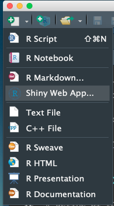{ width=20% }

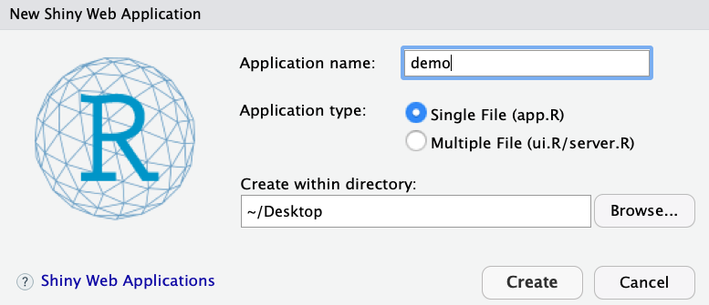{ width=50% }

Just like when creating a new R Markdown file, sample code is included when creating a Shiny app file. You will most likely want to delete most of the code if not all of it since it probably won't be part of the app you want to make. However, when building your own app you may want to keep the code as a template and then customize it to use with your data and specifications.

Before we go through actual code we'll cover the unique architecture of a Shiny app. It may look confusing at first but it's quite simple when broken down into pieces.


## Understanding the Architecture
There are two key components to every Shiny app: the **UI** (user interface) which defines how your app **looks**, and the **server function** that defines how your app **works**. Shiny uses **_reactive programming_** to automatically update app outputs when the inputs change. If you have ever used a function in an Excel spreadsheet that updates one cell value when another is changed, this is a simpler version of reactive programming. 

We'll talk about a different (slightly more advanced) way to create Shiny apps later. For now, when creating a Shiny app you need to have the following things in your file - which you must name `app.R`. We'll discuss why later on.

1. The shiny library must be loaded: `library(shiny)`
2. A user interface (`ui`) function
3. A `server` function
4. Code to launch the app: `shinyApp(ui = ui, server = server)`

Here are all of the elements you need to create a viable Shiny app.
```{r, eval=FALSE}
library(shiny)

# Define UI
ui <- fluidPage()

# Define server
server <- function(input, output) {}

shinyApp(ui = ui, server = server)
```

Having all of the necessary pieces in the file will produce an output - just not a very interesting one. When we run the above code we get a blank output. As we go along we'll add more code that will actually display a graph that changes with different inputs. For now, let's focus on the mechanics.


### Close the app
Once you are done running your Shiny app, you have to close it. If you notice, while the app is running you are unable to use the command line to do anything else in R. The app takes over the command line. Thus, to work on something else that involves the command line, or just stop working on the Shiny app, make sure to do one of the following to close your app:

1. Press the `stop` button at the top of the command line window
2. Press the `Esc` key 
3. Close the Shiny app window

### Our first Shiny app
For our first Shiny app, let's make an app that allows a user to choose an integer using a slider, takes that integer as input, randomly draws that number of values from a standard Normal distribution and creates a histogram of those values. This is a simple example and our histogram won't look very pretty because we won't be using `ggplot` for this example, but it's a great way to get started. We'll see other, more complicated and asthetically pleasing examples later. Here is what we want our output to look like:

<div style="text-align:center">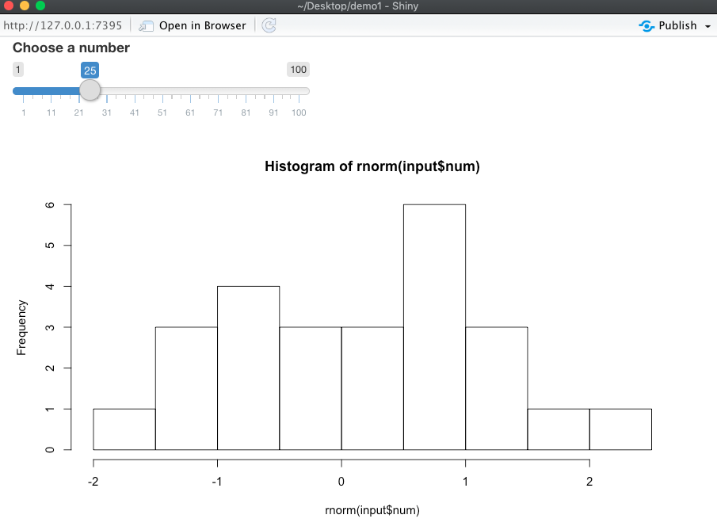</div>


### User Interface (UI)
Let's start with the `ui` function. Recall that the user interface defines how your app *looks*. Let's add some inputs and outputs to the `ui` function. To do this we'll add elements as arguments to `fluidPage()`.

```{r, eval=FALSE}
ui <- fluidPage(
  # *Input() functions,
  # *Output() functions
)
```

#### Inputs
You can create an input with an `*Input()` function. There are 12 basic options for inputs included in the shiny library:

* `actionButton()` / `submitButton()`
* `checkboxInput()`
* `checkboxGroupInput()`
* `dateInput()`
* `dateRangeInput()`
* `fileInput()`
* `numericInput()`
* `passwordInput()`
* `radioButtons()`
* `selectInput()`
* `sliderInput()`
* `textInput()`


<div style="text-align:center">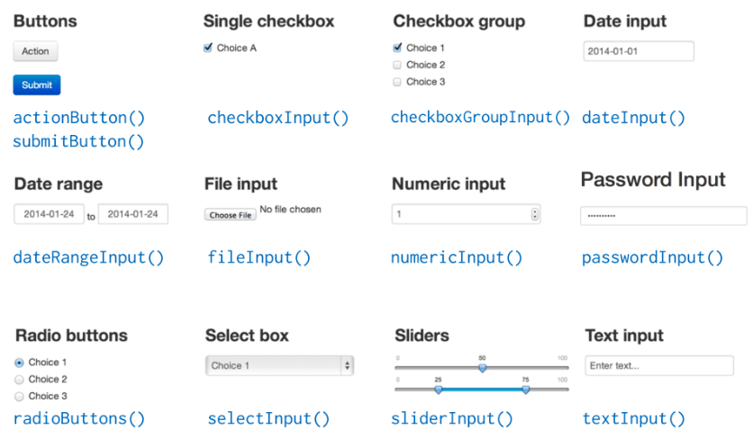</div>


Once you choose the type of input you would like to include, there are several arguments you need to pass to the function. All input functions require an `inputId` and `label`, but other arguments depend on the type of input. For our example, we want to include a slider input. This type of input function also requires us to specify values for `value`, `min` and `max`. 

We need to specify the 

* `inputId` (a name for the input value; you'll use this to link it with the `server` function),
* `label` (a name, phrase or set of words that tells the user what to do),
* `value` (the default value that appears when the app is opened),
* `min` and `max` (minimum and maximum values the input can be). 

The `inputId` has two constraints:

1. It must be a simple string that contains only letters, numbers, and underscores (no spaces, dashes, periods, or other special characters allowed!). Name it like you name variables in R.
2. It must be be unique. If it’s not unique, you’ll have no way to refer to this control in your server function!

Here I call the input `num`, I want the phrase `Choose a number` to appear at the top of the slider, I choose the default value to be 25 and the min and max to be 1 and 100, respectively.

```{r, eval = FALSE}
ui <- fluidPage(
  sliderInput(inputId = "num",
     label = "Choose a number",
     value = 25, min = 1, max = 100)
)
```
Here is what the slider and corresponding syntax looks like:

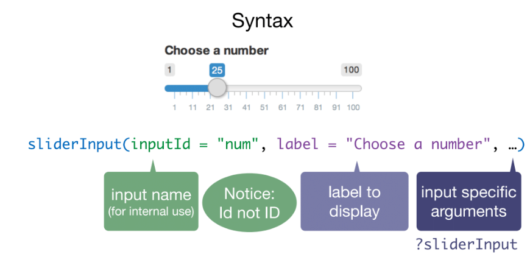{ width=80% }


#### Outputs
We have successfully added a slider input to our app. But that alone won't do anything useful. We want that input to inform an output. Output functions in the UI specification create placeholders that are filled by the server function.

Similar to the `*Input()` functions we just saw, there are several basic `*Output()` functions:

* `dataTableOutput()`
* `htmlOutput()`
* `imageOutput()`
* `plotOutput()`
* `tableOutput()`
* `textOutput()`
* `uiOutput()`
* `verbatimTextOutput()`

<div style="text-align:center">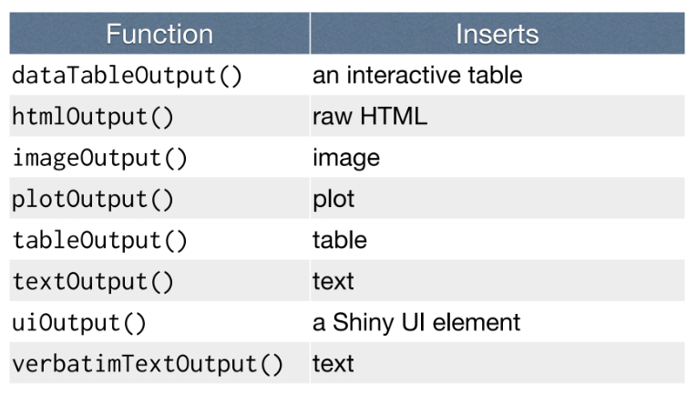</div>

Once you choose the type of output you would like to include, you need to name it by specifying an `outputId`. Like inputs, outputs take a unique ID as their first argument: if your UI specification creates an output with ID `"plot"`, you’ll access it in the server function with `output$plot`. Just like inputs, you should have a unique name for each output object to avoid errors. Let's name our output object `hist` since we ultimately want to make a histogram appear in our app.


<div style="text-align:center">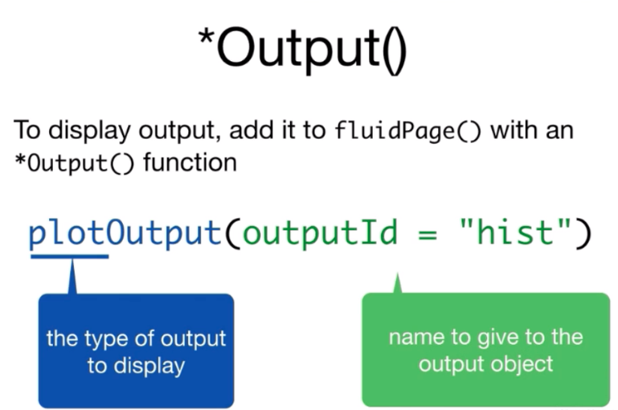</div>

Let's add this to our code. Don't forget to put a comma between the input and output arguments!
```{r, eval=FALSE}
ui <- fluidPage(
  sliderInput(inputId = "num",
     label = "Choose a number",
     value = 25, min = 1, max = 100),
  plotOutput(outputId = "hist")
)
```

At this point, the app knows you want there to be an output and will create a space for it - but it doesn't know what that output is or how it should work, just its name. In order to actually have the histogram appear (or any output you choose), you need to tell the `server` function how you want the output to be built. 

### Server
The server function defines how your app *works* - how to assemble the inputs into the outputs.

Recall the empty server function from above:
```{r, eval = FALSE}
server <- function(input, output){
   
}
```

Let's write our instructions in the server function so we can display our desired histogram. To do this you need to remember 3 rules:

1. Save objects to display to `output$`
2. Build objects to display with `render*()`
3. Use input values with `input$`

You'll notice that the server function takes `input` and `output` arguments. Both of these must be arguments in your server function and they will be list-like objects. 
First, we save an object to the hist element of the output list by typing `output$hist`. Here, we need to use the name "hist" since it will be placed in the plot named "hist" and matches the name we gave the output object in the `ui` function.
```{r, eval = FALSE}
server <- function(input, output){
   output$hist <- # code
}
```

Next we define a render function. Render functions work together with output functions to place an R object as HTML into a Shiny webpage. Typically there is a direct analog between an `output` function and a `render` function.

<div style="text-align:center">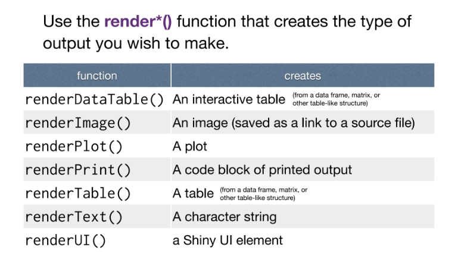</div>

We want to plot a histogram using input from a slider. But let's first look at the syntax for a simpler example. Let's say I want to plot a histogram of 100 random values from a standard Normal distribution. Then I would type `renderPlot({ hist(rnorm(100)) })`:

<div style="text-align:center">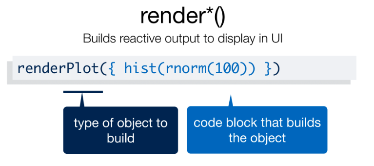</div>

Here, `rnorm()` is the command we use to randomly sample any number of values from a standard normal distribution. Type `?rnorm` in your Console to see more details about the command.

Back to our app - you can put as much code between the curly braces, even an entire R script, and it will pass it as a single chunk, or code block, to `renderPlot`. We're starting off with a basic plot but you can get very sophisticated outputs from passing code blocks.

Going back to our original example. The third rule states we should use `input` values with `input$`. In the `ui` function above we named the numeric value from the slider input "num". We can access this value in the `server` function by using `input$num`. That way we can take whatever value the slider is set to and use it to build an output - in our case a histogram.

```{r, eval = FALSE}
server <- function(input, output){
   output$hist <- renderPlot({
      hist(rnorm(input$num))
   })
}
```


We're finally ready to put it all together! Now that we have defined the `ui` and `server` functions we can add the `library(shiny)` command at the beginning of the app code and the command `shinyApp(ui = ui, server = server)` at the end of the app code. Remember, this last line of code is needed to launch the app. Here is our complete code in the `app.R` file and what the output looks like when we run the code:

```{r, eval=FALSE}
library(shiny)

# Define UI
ui <- fluidPage(
  sliderInput(inputId = "num",
              label = "Choose a number",
              value = 25, min = 1, max = 100),
  plotOutput(outputId = "hist")
)

# Define server
server <- function(input, output){
    output$hist <- renderPlot({
        hist(rnorm(input$num))
    })
}

shinyApp(ui = ui, server = server)
```

<div style="text-align:center"></div>

And that's it! You've made your very first Shiny app!


## Share your app
When you create a Shiny app on your laptop or desktop computer, the app is maintained by your machine running R:

<div style="text-align:center">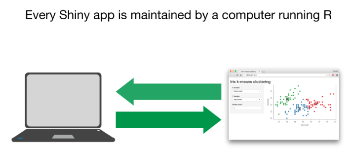</div>

However, you have the option of sharing your app online, like the examples in the Shiny Showcase. To do this visit [shinyapps.io](https://www.shinyapps.io/) and sign up. You can set up an email and password or use your Google or GitHub logins. Once you are signed up your dashboard will show up with instructions on how to install and authorize the `rsconnect` package and deploy your Shiny app. 

<div style="text-align:center">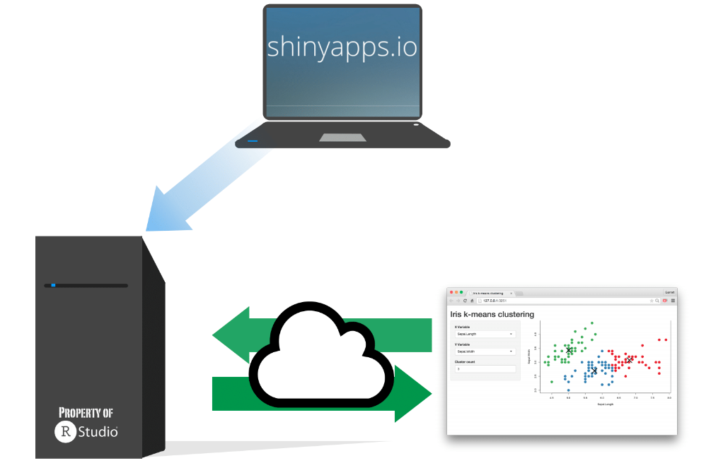</div>


Steps:

1. Install the `rsconnect` package .
2. Click the `Show Secret` button and then the `Copy to clipboard` button. Paste the code into the R command line.
3. Once you are ready to publish a Shiny app, load the `rsconnect` library and use the code `rsconnect::deployApp('path/to/your/app')`


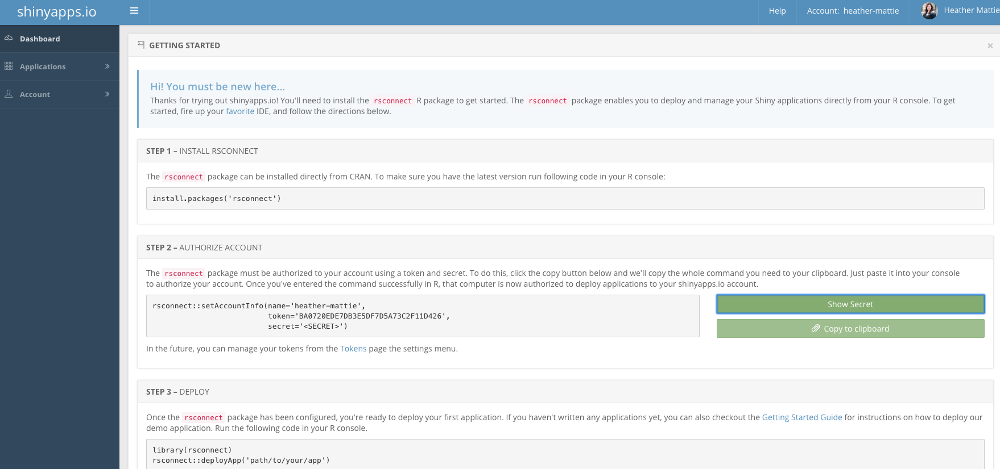


And that's it! Happy `Shiny`-ing!


