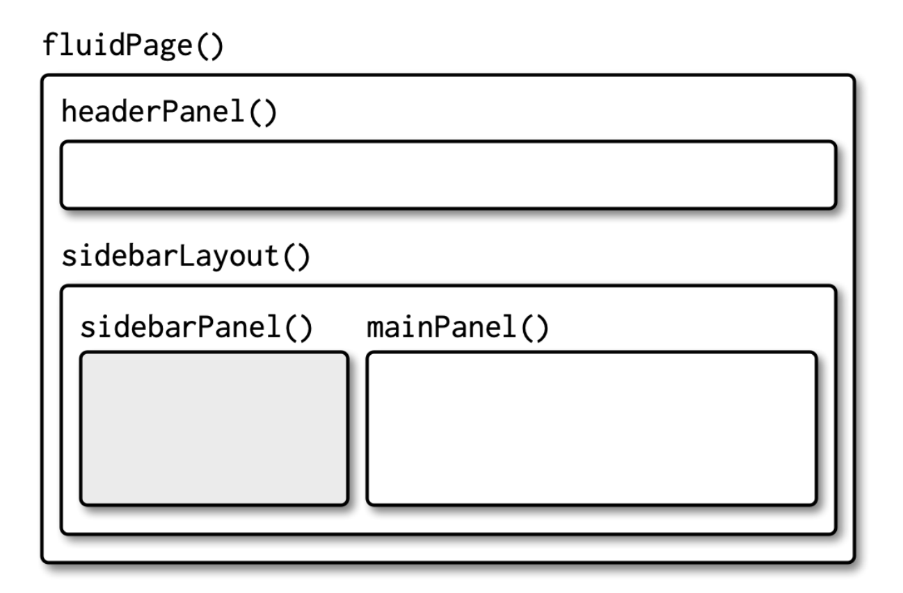
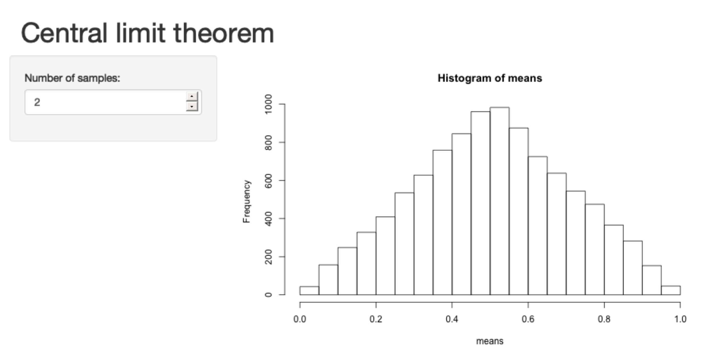
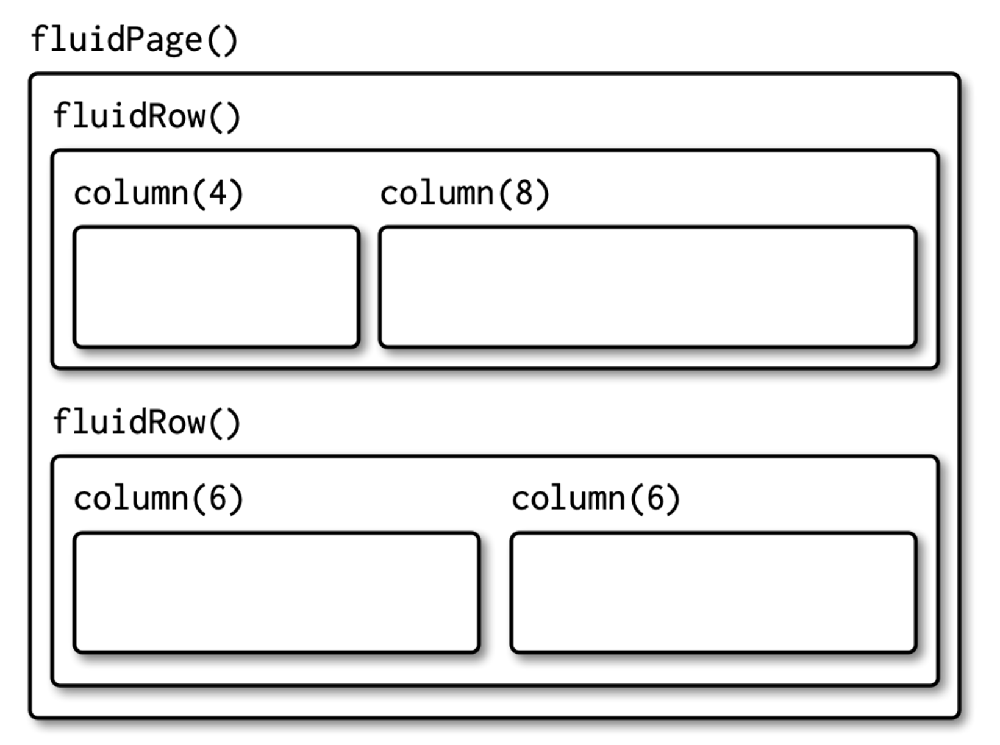
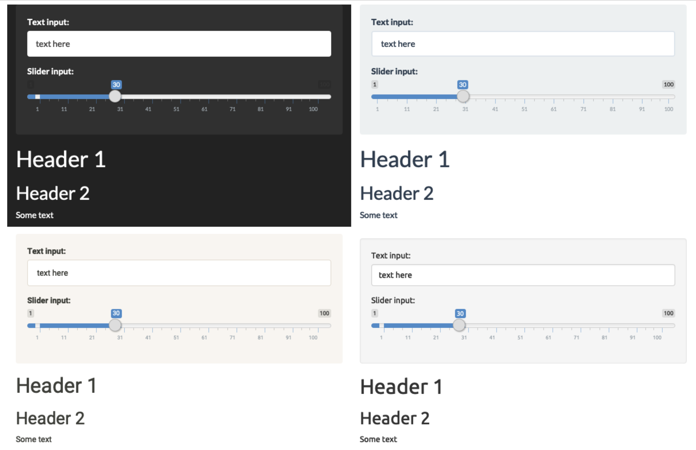

Now that you know how to create a full range of inputs and outputs, you need to be able to arrange them on the page. That’s the job of the layout functions, which provide the high-level visual structure of an app. Here we’ll focus on `fluidPage()`, which provides the layout style used by most apps. There are other, more advanced layout families like dashboards and dialog boxes but we won't cover them in this course. You can read chapter 12 of [Mastering Shiny](https://mastering-shiny.org/advanced-ui.html) for more information.

Layouts are created by a hierarchy of function calls, where the hierarchy in R matches the hierarchy in the output. When you see complex layout code like this:

```{r, eval=FALSE}
fluidPage(
  titlePanel("Hello Shiny!"),
  sidebarLayout(
    sidebarPanel(
      sliderInput("obs", "Observations:", min = 0, max = 1000, value = 500)
    ),
    mainPanel(
      plotOutput("distPlot")
    )
  )
)
```


First skim it by focusing on the hierarchy of the function calls:
```{r, eval=FALSE}
fluidPage(
  titlePanel(),
  sidebarLayout(
    sidebarPanel(
      sliderInput("obs")
    ),
    mainPanel(
      plotOutput("distPlot")
    )
  )
)
```

Even without knowing anything about the layout functions you can read the function names to guess what this app is going to look like. You might imagine that this code will generate a classic app design: a title bar at the top, followed by a sidebar (containing a slider), with the main panel containing a plot.

## Page functions
The page function sets up all the HTML, CSS, and JS that Shiny needs. `fluidPage()` uses a layout system called [Bootstrap](https://getbootstrap.com), that provides attractive defaults. Technically, `fluidPage()` is all you need for an app, because you can put inputs and outputs directly inside of it. But while this is fine for learning the basics of Shiny, dumping all the inputs and outputs in one place doesn’t look very good, so you need to learn more layout functions.

## Page with sidebar
`sidebarLayout()`, along with `titlePanel()`, `sidebarPanel()`, and `mainPanel()`, makes it easy to create a two-column layout with inputs on the left and outputs on the right. The basic code is shown below, it generates the structure shown in the figure below.

```{r, eval=FALSE}
fluidPage(
  titlePanel(
    # app title/description
  ),
  sidebarLayout(
    sidebarPanel(
      # inputs
    ),
    mainPanel(
      # outputs
    )
  )
)
```

<center></center>


Here's an example of an app with this layout:

```{r, eval=FALSE}
ui <- fluidPage(
  headerPanel("Central limit theorem"),
  sidebarLayout(
    sidebarPanel(
      numericInput("m", "Number of samples:", 2, min = 1, max = 100)
    ),
    mainPanel(
      plotOutput("hist")
    )
  )
)

server <- function(input, output, server) {
  output$hist <- renderPlot({
    means <- replicate(1e4, mean(runif(input$m)))
    hist(means, breaks = 20)
  })
}
```

<center></center>


## Multi-row
Under the hood, `sidebarLayout()` is built on top of a flexible multi-row layout, which you can use directly to create more visually complex apps. As usual, you start with `fluidPage()`. Then you create rows with `fluidRow()`, and columns with `column()`. The following template generates the structure shown in the figure below.

```{r, eval=FALSE}
fluidPage(
  fluidRow(
    column(4, 
      ...
    ),
    column(8, 
      ...
    )
  ),
  fluidRow(
    column(6, 
      ...
    ),
    column(6, 
      ...
    )
  )
)
```

<center></center>


Note that the first argument to `column()` is the width, and **the width of each row must add up to 12**. This gives you substantial flexibility because you can easily create 2-, 3-, or 4-column layouts (more than that starts to get cramped), or use narrow columns to create spacers.

## Themes
Another way to customize your app is to use different themes. You can create your own theme from scratch but this is a lot of work and outside the scope of this course. An easier option is to use the `shinythemes` package. Here are 4 options:

```{r, eval=FALSE}
theme_demo <- function(theme) {
  fluidPage(
    theme = shinythemes::shinytheme(theme),
    sidebarLayout(
      sidebarPanel(
        textInput("txt", "Text input:", "text here"),
        sliderInput("slider", "Slider input:", 1, 100, 30)
      ),
      mainPanel(
        h1("Header 1"),
        h2("Header 2"),
        p("Some text")
      )
    )
  )
}
theme_demo("darkly")
theme_demo("flatly")
theme_demo("sandstone")
theme_demo("united")
```


<center></center>

You can check out more options at the [Shiny theme selector app](https://shiny.rstudio.com/gallery/shiny-theme-selector.html).


