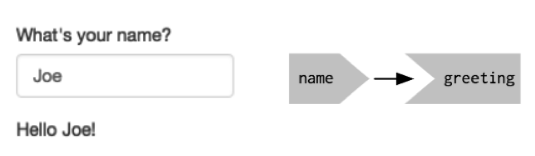
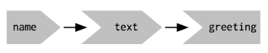
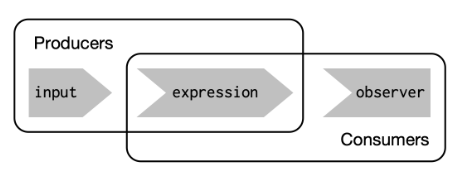
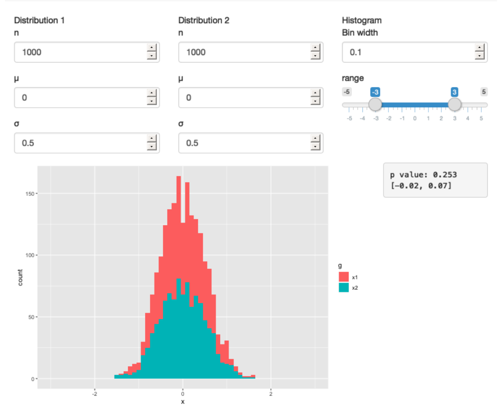
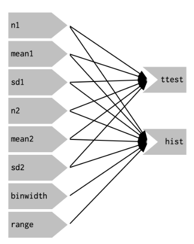
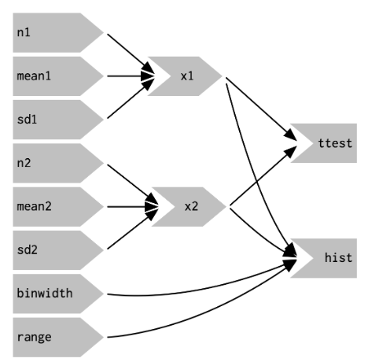
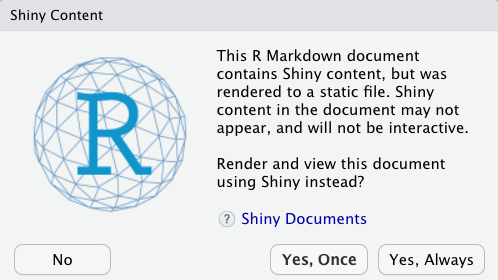

```{r, message=FALSE, warning=FALSE, echo=FALSE}
library(shiny)
library(shinythemes)
library(dslabs)
library(dplyr)
library(ggplot2)
library(RColorBrewer)
```


Now that we've learned a bit about layouts and the basics of a Shiny app, let's move on to more examples of basic reactivity and a few other more advanced options.


## Reactivity
We've seen how we can make an output reactive to an input - when an inputs changes the outout is updated by using one of the `render*()` functions. This informs Shiny how it could create an output it needs to. It’s up to Shiny when (and even if!) the code should be run. It might be run as soon as the app launches, it might be quite a bit later; it might be run many times, or it might never be run! It’s Shiny’s responsibility to decide when code is executed, not yours. Think of your app as providing Shiny with recipes, not giving it commands. This is the main difference between the coding we have done thus far in the course (imperative programming) and the coding we have been learning for Shiny apps (declarative programming). 

* In **imperative programming**, you issue a specific command and it’s carried out immediately. This is the style of programming you’re used to in your analysis scripts: you command R to load your data, transform it, visualize it, and print or save the results.

* In **declarative programming**, you express higher-level goals or describe important constraints, and rely on someone else to decide how and/or when to translate that into action. This is the style of programming you use in Shiny.

### The reactive graph
In most R code, you can understand the order of execution by reading the code from top to bottom. That doesn’t work in Shiny, because code is only run when needed. To understand the order of execution you need to instead look at the reactive graph, which describes how inputs and outputs are connected. For example, if I have a text output (greeting) that changes when a (text) input changes, the reactive graph would look like this:

<center></center>

It’s important to understand that the order in which your code is run is determined solely by the reactive graph. This is different from most R code where the execution order is determined by the order of lines. **The order in which reactive code is run is determined only by the reactive graph, not by its layout in the server function**.


### Reactive expressions
There’s one more important component that you’ll see in the reactive graph: the reactive expression. We’ll come back to reactive expressions in detail in a moment - for now think of them as a tool that **reduces duplication** in your reactive code by introducing additional nodes into the reactive graph.

We don’t need a reactive expression in our very simple app, but I’ll add one anyway so you can see how it affects the graph:
```{r}
# Before reactive expression
ui <- fluidPage(
  textInput("name", "What's your name?"),
  textOutput("greeting")
)

server <- function(input, output, session) {
  output$greeting <- renderText({
    paste0("Hello ", input$name, "!")
  })
}

# After reactive expression
server <- function(input, output, session) {
  text <- reactive(paste0("Hello ", input$name, "!"))
  output$greeting <- renderText(text())
}
```


<center></center>

Reactive expressions take inputs and produce outputs so they have a shape that combines features of both inputs and outputs. Hopefully, the shapes will help you remember how the components fit together.


Reactive expressions are important for two reasons:

1. They give Shiny more information so that it can do less recomputation when inputs change, making apps more efficient.
2. They make it easier for humans to understand the app by simplifying the reactive graph.

Reactive expressions have a flavor of both inputs and outputs:

* Like inputs, you can use the results of a reactive expression in an output.
* Like outputs, reactive expressions depend on inputs and automatically know when they need updating.

Because of this duality, some functions work with either reactive inputs or expressions, and some functions work with either reactive expressions or reactive outputs. We’ll use producers to refer either reactive inputs or expressions, and consumers to refer to either reactive expressions or outputs.

<center></center>

### Example
Let's look at a concrete example. This example also comes from [Mastering Shiny](https://mastering-shiny.org/advanced-ui.html) (chapter 4) and the live app can be accessed [here](https://hadley.shinyapps.io/basic-reactivity-cs/).

Imagine I want to compare two simulated datasets with a plot and a hypothesis test. I’ve done a little experimentation and decided I want to include a histogram which visualizes the two distributions, and a t-test to compare means and summarize the results with a table. I have created two functions to do this:

```{r, eval=FALSE}
library(ggplot2)

histogram <- function(x1, x2, binwidth = 0.1, xlim = c(-3, 3)) {
  df <- data.frame(
    x = c(x1, x2),
    g = c(rep("x1", length(x1)), rep("x2", length(x2)))
  )

  ggplot(df, aes(x, fill = g)) +
    geom_histogram(binwidth = binwidth) +
    coord_cartesian(xlim = xlim)
}

t_test <- function(x1, x2) {
  test <- t.test(x1, x2)
  
  sprintf(
    "p value: %0.3f\n[%0.2f, %0.2f]",
    test$p.value, test$conf.int[1], test$conf.int[2]
  )
}
```

If I have some simulated data, I can use these functions to compare two variables:

```{r, eval=FALSE}
# Draw 100 values from a Normal distribution with mean 0 and standard deviation 0.5
x1 <- rnorm(100, mean = 0, sd = 0.5)
# Draw 100 values from a Normal distribution with mean 0.15 and standard deviation 0.9
x2 <- rnorm(200, mean = 0.15, sd = 0.9)

histogram(x1, x2)
cat(t_test(x1, x2))
#> p value: 0.131
#> [-0.30, 0.04]
```


I’d like to use these tools to quickly explore a bunch of simulations. A Shiny app is a great way to do this because it lets you avoid tediously modifying and re-running R code. Below I wrap the pieces into a Shiny app where I can interactively tweak the inputs.

Let’s start with the `UI`. The first row has three columns for input controls (distribution 1, distribution 2, and plot controls). The second row has a wide column for the plot, and a narrow column for the hypothesis test.

```{r, eval=FALSE}
ui <- fluidPage(
  fluidRow(
    column(4, 
      "Distribution 1",
      numericInput("n1", label = "n", value = 1000, min = 1),
      numericInput("mean1", label = "µ", value = 0, step = 0.1),
      numericInput("sd1", label = "σ", value = 0.5, min = 0.1, step = 0.1)
    ),
    column(4, 
      "Distribution 2",
      numericInput("n2", label = "n", value = 1000, min = 1),
      numericInput("mean2", label = "µ", value = 0, step = 0.1),
      numericInput("sd2", label = "σ", value = 0.5, min = 0.1, step = 0.1)
    ),
    column(4,
      "Histogram",
      numericInput("binwidth", label = "Bin width", value = 0.1, step = 0.1),
      sliderInput("range", label = "range", value = c(-3, 3), min = -5, max = 5)
    )
  ),
  fluidRow(
    column(9, plotOutput("hist")),
    column(3, verbatimTextOutput("ttest"))
  )
)
```

The server function combines calls to `histogram()` and `t_test()` functions written above after drawing from the specified distributions:

```{r, eval=FALSE}
server <- function(input, output, session) {
  output$hist <- renderPlot({
    x1 <- rnorm(input$n1, input$mean1, input$sd1)
    x2 <- rnorm(input$n2, input$mean2, input$sd2)
    
    histogram(x1, x2, binwidth = input$binwidth, xlim = input$range)
  })

  output$ttest <- renderText({
    x1 <- rnorm(input$n1, input$mean1, input$sd1)
    x2 <- rnorm(input$n2, input$mean2, input$sd2)
    
    t_test(x1, x2)
  })
}
```

<center></center>

Let’s start by drawing the reactive graph of this app. Shiny is smart enough to update an output only when the inputs it refers to change - it’s not smart enough to only selectively run pieces of code inside an output. In other words, outputs are atomic: they’re either executed or not as a whole.

For example, take this snippet from the server:

```{r, eval=FALSE}
x1 <- rnorm(input$n1, input$mean1, input$sd1)
x2 <- rnorm(input$n2, input$mean2, input$sd2)
t_test(x1, x2)
```

As a human reading this code you can tell that we only need to update `x1` when `n1`, `mean1`, or `sd1` changes, and we only need to update `x2` when `n2`, `mean2`, or `sd2` changes. Shiny, however, only looks at the output as a whole, so it will update both `x1` and `x2` every time one of `n1`, `mean1`, `sd1`, `n2`, `mean2`, or `sd2` changes. This leads to the reactive graph shown below:

<center></center>

You’ll notice that the graph is very dense: almost every input is connected directly to every output. This creates two problems:

1. The app is hard to understand because there are so many connections. There are no pieces of the app that you can pull out and analyze in isolation.
2. The app is inefficient because it does more work than necessary. For example, if you change the breaks of the plot, the data is recalculated; if you change the value of `n1`, `x2` is updated (in two places!).

There’s one other major flaw in the app: the histogram and t-test use separate random draws. This is rather misleading, as you’d expect them to be working on the same underlying data.

Fortunately, we can fix all these problems by using reactive expressions to pull out repeated computation.

In the server function below we refactor the existing code to pull out the repeated code into two new reactive expressions, `x1` and `x2`, which simulate the data from the two distributions. To create a reactive expression, we call `reactive()` and assign the results to a variable. To later use the expression, we call the variable like it’s a function.

```{r, eval=FALSE}
server <- function(input, output, session) {
  # Define x1 and x2 as reactive expressions
  x1 <- reactive(rnorm(input$n1, input$mean1, input$sd1))
  x2 <- reactive(rnorm(input$n2, input$mean2, input$sd2))

  output$hist <- renderPlot({
  # Use x1 and x2 like functions
    histogram(x1(), x2(), binwidth = input$binwidth, xlim = input$range)
  })

  output$ttest <- renderText({
    t_test(x1(), x2())
  })
}
```

This transformation yields the substantially simpler graph shown below. This simpler graph makes it easier to understand the app because you can understand connected components in isolation; the values of the distribution parameters only affect the output via `x1` and `x2`. This rewrite also makes the app much more efficient since it does much less computation. Now when you change the binwidth or range, only the plot changes, not the underlying data.

<center></center>


## Tabs
You can create an app with different tabs using `tabsetPanel()` and `tabPanel()`. The general layout looks like this:

```{r, eval=FALSE}
ui <- fluidPage(
  tabsetPanel(
    # First tab
    tabPanel( 
      # inputs and outputs
    ),
    
    # Second tab
    tabPanel(
      # inputs and outputs
    ),
    
    # Third tan
    tabPanel(
      # inputs and outputs
    )
  )
)
```

You can also see these function in action in the Shiny app code below.

## Formatted text
Many times you will want to format your text in some way, add an image or include hyperlinks. To add more advanced content, you can use [Shiny’s HTML tag functions](https://shiny.rstudio.com/tutorial/written-tutorial/lesson2/). Some of them are provided below:

* `p()` creates a paragraph of text.
* `h1()`, `h2()`, ..., `h6()` create different sizes of headers.
* `em()` creates italicized (i.e, emphasized) text.
* `a("Text to highlight", href = "url")` creates a hyperlink.
* `br()` creates a line break (e.g. a blank line).
* `code()` creates a formatted block of code.
* `img()` creates an image.
* `strong()` creates bold text.

I include `p()`, `br()`, `a()` and `strong()` in the example below.

## Embedding Shiny apps in RMarkdown
Rather than creating a stand alone Shiny app, you have the option of embedding a Shiny app into an RMarkdown file. You can achieve this using the `shinyApp()` function that comes as part of the `shiny` package. Here, you place the `UI` and `server` functions inside the `shinyApp()` function and place all of this inside a code chunck. You also need to load any packages, functions or data you'll need for your Shiny app **before and outside of the `shinyApp()` function**. You can see an example below. One thing to note is that you **do not** need to include the line `shinyApp(ui = ui, server = server)` when using the `shinyApp()` function. Another is that the first time you knit your file this box will pop up:

<center></center>


Click `Yes, Always` and the `knit` button at the top will turn into a `Run Document` button and the Shiny app will run each time you "knit" or run the document. **Also note that the Shiny app will not work if you open the html file associated with the .Rmd file containing a Shiny app** - Shiny apps need to run on a server and an html file is a static file not connected to a server.


```{r}
data(gapminder)
data(us_contagious_diseases)

shinyApp(
ui = fluidPage(
  # Change theme to darkly
  theme = shinythemes::shinytheme("darkly"),
  # Application title
  titlePanel("My More Advanced Shiny App"),
  
  # Create an app with 2 tabs
  tabsetPanel(
    # First tab: the Hans Rosling plot from TED talk
    # Scatter plot that compares life expectancy and fertility
    # for each country over time with an animated bar for the years
    tabPanel("Gapminder",
             sidebarLayout(
               sidebarPanel(
                 # Add some text and a couple of hyper links before the slider for year
                 p("The plots generated here are inspired by the", a("TED talk given by
                   Hans Rosling.", 
                   href="https://www.ted.com/talks/hans_rosling_shows_the_best_stats_you_ve_ever_seen"),
                   "The data used was created using a number of spreadsheets 
                   available from the", a("Gapminder Foundation", href="http://www.gapminder.org/")),
                 
                 # Add some space between the text above and animated
                 # slider bar below
                 br(),
                 
                 # Input: year slider with basic animation
                 sliderInput("year", "Year:",
                             min = 1960, max = 2015,
                             value = 1960, 
                             step = 1,
                             sep = "",       # keep years in year format and not 1,960 format
                             ticks = FALSE,  # don't show tick marks on slider bar
                             animate = TRUE) # add play button to animate
               ),
               
               # Show a scatter plot for all countries
               mainPanel(
                 plotOutput("scatterPlot")
               )
             )),
    
    # Second tab: tile plot of infectious diseases
    # Include dropdown menu of diseases to choose from 
    tabPanel("Vaccines",
             sidebarLayout(
               sidebarPanel(
                 # Paragraph with some text about vaccines and the data source
                 # strong("Vaccines") makes the word Vaccines bold
                 p(strong("Vaccines"), "have helped save millions of lives. In the 19th century, 
                   before herd immunization was achieved through vaccination programs, 
                   deaths from infectious diseases, like smallpox and polio, were common. 
                   However, today, despite all the scientific evidence for their importance, 
                   vaccination programs have become somewhat controversial. Effective 
                   communication of data is a strong antidote to misinformation and fear mongering.
                   The data used for these plots were collected, organized and distributed by the 
                   Tycho Project."),
                 
                 # Adding br() will add space between the text above and the dropdown
                 # menu below
                 br(),
                 
                 # Dropdown menu that allows the user to choose a disease
                 selectInput("disease", label = "Select contagious disease",
                             choices = as.list(levels(us_contagious_diseases$disease)))
               ),
               
               # Show a tile plot of disease rate across states and years
               mainPanel(
                 plotOutput("tilePlot")
               )
             ))
  )
),

server = function(input, output) {

	# Scatterplot of fertility rate vs life expectancy
	output$scatterPlot = renderPlot({
	       # Filter year to be the input year from the slider
	       gapminder %>% filter(year %in% input$year & !is.na(fertility)) %>%
		     ggplot(aes(fertility, life_expectancy, color = continent, size = population/10^6)) +
		     geom_point(alpha = 0.5) +
		     xlab("Fertility (Average number of children per woman)") +
		     ylab("Life expectancy (Years)") +
	    
	       # Set x and y axis limits to keep the same for each year
		     scale_x_continuous(breaks = seq(0, 9), limits = c(1, 8)) +
	       scale_y_continuous(breaks = seq(30, 85, 5), limits = c(30, 85)) +
	       # Make the legend titles nicer
		     scale_color_discrete(name = "Continent") +
		     scale_size_continuous(name = "Population in millions") +
	    
	       # Change the title of the plot for each year
	       # Returns a character vector containing a formatted combination 
	       # of text and variable values
	       ggtitle(sprintf("Life expectancy vs. fertility in %d", input$year)) +
		     theme_bw()
		     })
	
	# Tile plot for contagious disease rates across states
	
	output$tilePlot = renderPlot({
	       # Filter to disease specified from dropdown menu
	       the_disease <- input$disease
	       dat <- us_contagious_diseases %>%
	       filter(!state %in% c("Hawaii","Alaska"), disease == the_disease) %>%
	       mutate(rate = (count / weeks_reporting) * 52 / (population / 100000))
	       
	       # Create a list of years corresponding to the years each vaccine was 
	       # introduced in the US (will use this to add a vertical line to the plot
	       # showing when the vaccine was introduced)
	       vaccines <- c("Hepatitis A" = 1995, "Measles" = 1963, "Mumps" = 1967,
	                     "Pertussis" = 1945, "Polio" = 1955, "Rubella" = 1969, "Smallpox" = 1939)
	       
	       dat %>% 
	       ggplot(aes(x = year, y = state,  fill = rate)) +
	       geom_tile(color = "grey50") +
	       scale_x_continuous(expand = c(0,0)) +
	       scale_fill_gradientn("Cases per\n100,000", 
	                            colors = brewer.pal(9, "Reds"), 
	                            trans = "sqrt") +
	        # Use list above for vertical line intercept
	        geom_vline(xintercept = vaccines[the_disease], col = "blue") +
	        theme_minimal() +  
	        theme(panel.grid = element_blank()) +
	       
	        # Another way to change the text of the title
	        ggtitle(input$disease, "Cases per 100,000 by State") + 
	        ylab("") + xlab("") })

}
)
```