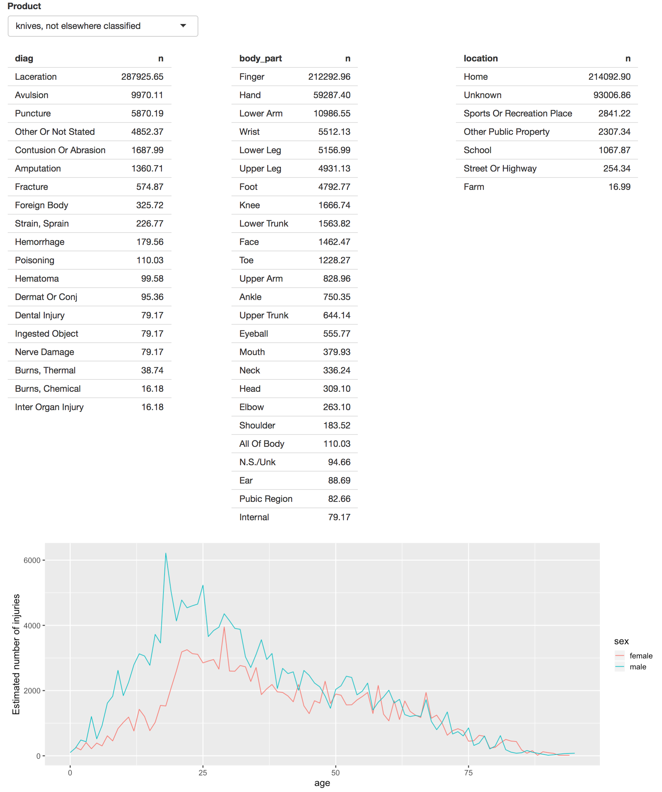
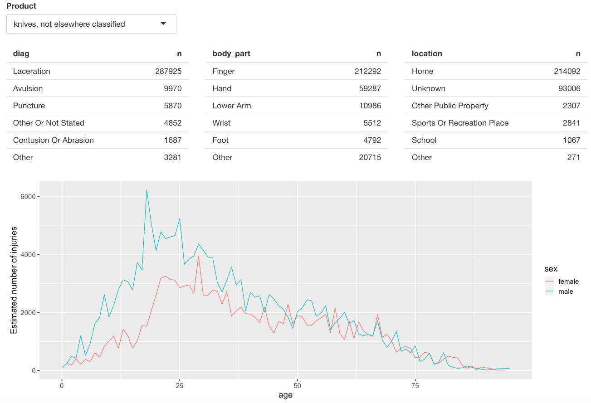
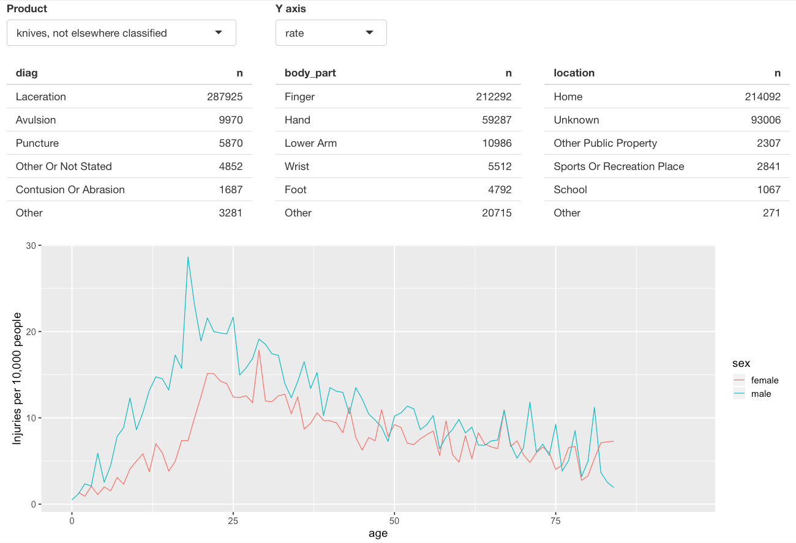
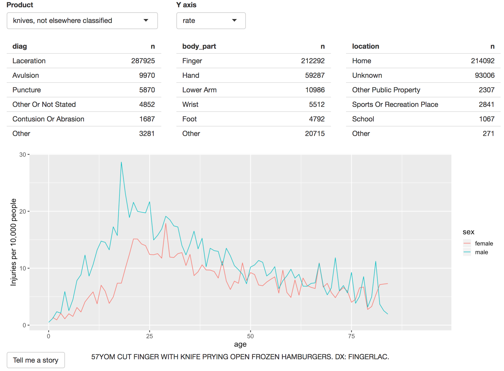

Let's try to make a Shiny app that's a bit more complex. The data we'll be using comes from the [National Electronic Injury Surveillance System (NEISS)](https://www.cpsc.gov/Research--Statistics/NEISS-Injury-Data) that’s collected by Consumer Product Safety Commission (CPSC). The primary purpose of NEISS is to collect data on consumer product-related injuries occurring in the United States. This data is what CPSC uses to produce nationwide estimates of product-related injuries. This is a long-term study that records all accidents seen in a representative sample of hospitals in the United States. It’s an interesting dataset to explore because it’s readily understandable, and each observation is accompanied by a short narrative that explains how the accident occured.

We'll also be basing our app on the case study found in Chapter 5 of [Mastering Shiny](https://mastering-shiny.org/) by Hadley Wickham. All of the code and data we use can be found on [GitHub](https://github.com/hadley/neiss).

```{r, message=FALSE, echo=FALSE, warning=FALSE}
library(shiny)
library(vroom)
library(tidyverse)
# install.packages("devtools")
devtools::install_github("hadley/neiss")
```


Due to the size of the dataset, here we will only use data from 2017. The main dataset we'll use is `injuries` which contains ~250,000 observations and 10 variables.
```{r, message=FALSE, warning=FALSE}
injuries <- vroom::vroom("injuries.tsv.gz")
injuries
```

Each row represents a single accident:

* `trmt_date` is date the person was seen in the hospital (not when the accident occured).

* `age`, `sex`, and `race` give demographic information about the person who experienced the accident.

* `body_part` is the location of the injury on the body (like ankle or ear).

* `diag` gives the basic diagnosis of the injury (like fracture or laceration).

* `location` is the place where it occurred (like home or school).

* `prod_code` is the primary product associated with the injury.

* `weight` is the statistical weight giving the estimated number of people who would suffer this injury if this dataset was scaled to the entire population of the US.

* `narrative` is a brief story about how the accident occurred.

We’ll pair this dataset with two other data frames for additional context. `products` lets us look up the product name from the product code, and `population` tells us the total US population in 2017 for each combination of age and sex.

```{r, message=FALSE, warning=FALSE}
products <- vroom::vroom("products.tsv")
products
```

```{r, message=FALSE, warning=FALSE}
population <- vroom::vroom("population.tsv")
population
```

### Data Exploration
It's always a best practice to explore your data before starting to create a Shiny app. That way you can get an idea of the information available to you and the possible elements you can include in your app.

Let's start with looking at the product associated with the most injuries: `"stairs or steps"` (product code number 1842). First let's filter out the injuries associated with this product.

```{r}
selected <- injuries %>% filter(prod_code == 1842)
nrow(selected)
```

Now let's look at summary statistics about body part, diagnosis, and location where the injury occurred. If we include `weight` we can interpret the results as estimated total injuries across the whole US. 
```{r}
selected %>% count(diag, wt = weight, sort = TRUE)
selected %>% count(body_part, wt = weight, sort = TRUE)
selected %>% count(location, wt = weight, sort = TRUE)
```

As you might expect, steps are most often associated with sprains, strains and fractures of the ankle ocurring at home.

We can also explore the pattern across age and sex. We have enough data here that a table is not that useful, and a plot makes the patterns more obvious:
```{r}
summary <- selected %>% 
           count(age, sex, wt = weight)
summary
```


```{r}
summary %>% ggplot(aes(age, n, colour = sex)) + 
            geom_line() + 
            labs(y = "Estimated number of injuries")
```

We see a big spike when children are learning to walk, a flattening off over middle age, and then a gradual decline after age 50. Interestingly, the number of injuries is much higher for women.

One problem with interpreting this pattern is that we know that there are fewer older people than younger people, so the population available to be injured is smaller. We can control for this by comparing the number of people injured with the total population and calculating an injury rate. Let's use a rate per 10,000 because that gives a number that’s easy to interpret.
```{r}
summary <- selected %>% 
           count(age, sex, wt = weight) %>% 
           left_join(population, by = c("age", "sex")) %>% 
           mutate(rate = n / population * 10^4)

summary
```

Plotting the rate yields a strikingly different trend after age 50: while the number of injuries decreases, the rate of injuries continues to increase.
```{r}
summary %>% ggplot(aes(age, rate, colour = sex)) + 
            geom_line(na.rm = TRUE) + 
            labs(y = "Injuries per 10,000 people")
```

Finally, we can look at some of the narratives. Browsing through these is an informal way to check our hypotheses, and generate new ideas for further exploration. Here I pull out a random sample of 10:
```{r}
selected %>% sample_n(10) %>% 
             pull(narrative)
```

### Making the app
Now that we've done some exploring and have some ideas about what we can include in a Shiny app, let's start simple and work our way up to a more complex app. After looking at my data I sit down and think about what would be the most informative or useful information/visualizations to include in an app, and then draw out what I want it to look like.

Let's start with one row for the inputs (accepting that we'll probably add more inputs before this app is done), one row for all three tables (giving each table 4 columns, 1/3 of the 12 column width), and then one row for the plot:

```{r, eval = FALSE}
ui <- fluidPage(
  fluidRow(
    column(6,
      selectInput("code", "Product", setNames(products$prod_code, products$title))
    )
  ),
  fluidRow(
    column(4, tableOutput("diag")),
    column(4, tableOutput("body_part")),
    column(4, tableOutput("location"))
  ),
  fluidRow(
    column(12, plotOutput("age_sex"))
  )
)
```

The server function is relatively straightforward. We convert the selected and summary variables to reactive expressions. This is a reasonable general pattern - you probably typically create variables in your data analysis as a way of decomposing the analysis into steps, and avoid having to recompute things multiple times, and reactive expressions play the same role in Shiny apps. Often it’s a good idea to spend a little time cleaning up your analysis code before you start your Shiny app, so you can think about these problems in regular R code, before you add the additional complexity of reactivity.

```{r, eval=FALSE}
server <- function(input, output, session) {
  selected <- reactive(injuries %>% filter(prod_code == input$code))

  output$diag <- renderTable(
    selected() %>% count(diag, wt = weight, sort = TRUE)
  )
  output$body_part <- renderTable(
    selected() %>% count(body_part, wt = weight, sort = TRUE)
  )
  output$location <- renderTable(
    selected() %>% count(location, wt = weight, sort = TRUE)
  )

  summary <- reactive({
    selected() %>%
      count(age, sex, wt = weight) %>%
      left_join(population, by = c("age", "sex")) %>%
      mutate(rate = n / population * 10^4)
  })

  output$age_sex <- renderPlot({
    summary() %>%
      ggplot(aes(age, n, colour = sex)) +
      geom_line() +
      labs(y = "Estimated number of injuries") +
      theme_grey(15)
  })
}
```


Note in this case `summary` isn’t strictly necessary; because it’s only used by a single reactive consumer. But it’s good practice to keep computing and plotting separate as it makes the flow of the app easier to understand, and will make it easier to generalise in the future.

Here is a screenshot of what we've made so far:



### Nicer tables

Now that we have the basic components in place, and working, we can progressively improve our app. The first problem with this app is that it shows a lot of information in the tables, where we probably just want the highlights. To fix this we need to need to first figure out how to truncate the tables. I’ve chosen to do that with a combination of forcats functions: I convert the variable to a factor, order by the frequency of the levels, and then lump together all levels after the top 5.

```{r, eval=FALSE}
injuries %>%
  mutate(diag = fct_lump(fct_infreq(diag), n = 5)) %>%
  group_by(diag) %>%
  summarise(n = as.integer(sum(weight)))
```

Because I knew how to do it, I wrote a little function to automate this for any variable. The details aren’t really important here, and don’t worry if this looks totally foreign - you could also solve the problem via copy and paste.

```{r, eval=FALSE}
count_top <- function(df, var, n = 5) {
  df %>%
    mutate({{ var }} := fct_lump(fct_infreq({{ var }}), n = n)) %>%
    group_by({{ var }}) %>%
    summarise(n = as.integer(sum(weight)))
}
```


I then use this in the server function:

```{r, eval=FALSE}
output$diag      <- renderTable(count_top(selected(), diag), width = "100%")
output$body_part <- renderTable(count_top(selected(), body_part), width = "100%")
output$location  <- renderTable(count_top(selected(), location), width = "100%")
```

I made one other change to improve the aesthetics of the app: I forced all tables to take up the maximum width (i.e. fill the column that they appear in). This makes the output more aesthetically pleasing because it reduces the amount of extraneous variaton.



### Rate vs Count
So far, we’re displaying only a single plot, but we’d like to give the user the choice between visualising the number of injuries or the population-standardized rate. First I add a control to the UI. Here I’ve chosen to use a `selectInput()` because it makes both states explicit, and it would be easy to add new states in the future:

```{r, eval=FALSE}
fluidRow(
    column(4,
      selectInput("code", "Product", setNames(products$prod_code, products$title))
    ),
    column(2, selectInput("y", "Y axis", c("rate", "count")))
  ),
```


(I default to `rate` because of the better interpretation.)

Then I condition on that input when generating the plot:
```{r, eval=FALSE}
  output$age_sex <- renderPlot({
    if (input$y == "count") {
      summary() %>%
        ggplot(aes(age, n, colour = sex)) +
        geom_line() +
        labs(y = "Estimated number of injuries") +
        theme_grey(15)
    } else {
      summary() %>%
        ggplot(aes(age, rate, colour = sex)) +
        geom_line(na.rm = TRUE) +
        labs(y = "Injuries per 10,000 people") +
        theme_grey(15)
    }
  })
```



### Narrative
Finally, I want provide some way to access the narratives because they are interesting and give an informal way to cross-check the hypotheses you come up with when looking at the plots. In the R code, I sample multiple narratives at once, but there’s no reason to do that in an app since you can do it interactively.

There are two parts to the solution. First we add a new row to the bottom of the UI. I use an action button to trigger a new story, and put the narrative in a `textOutput()`:
```{r, eval=FALSE}
  fluidRow(
    column(2, actionButton("story", "Tell me a story")),
    column(10, textOutput("narrative"))
  )
```


The result of an action button is an integer that increments each time it’s clicked. Here I just use it to trigger a re-execution of the random selection:
```{r, eval=FALSE}
output$narrative <- renderText({
    input$story
    selected() %>% pull(narrative) %>% sample(1)
  })
```



Let's put it all together here once again using the `shinyApp()` function. I have also included the stand alone app in the `shiny` folder on [github](https://github.com/datasciencelabs/2019/tree/master/shiny) - it's named `narrative_app.R`.
```{r}
library(tidyverse)
library(vroom)
library(shiny)

# Remember all functions must be included outside of the shinyApp function
if (!exists("injuries")) {
  injuries <- vroom::vroom("injuries.tsv.gz")
  products <- vroom::vroom("products.tsv")
  population <- vroom::vroom("population.tsv")
}

# fct_infreq: orders by frequency of occurrence
# fct_lump: lumps together the rest of the lesser occurring categories into one "other" category
count_top <- function(df, var, n = 5) {
  df %>%
    mutate({{ var }} := fct_lump(fct_infreq({{ var }}), n = n)) %>%
    group_by({{ var }}) %>%
    summarise(n = as.integer(sum(weight)))
}

shinyApp(ui <- fluidPage(
  #<< first-row
  fluidRow(
    column(4,
           selectInput(inputId = "code", 
                       label = "Product", 
                       setNames(products$prod_code, products$title))
    ),
    column(2, selectInput(inputId = "y", 
                          label = "Y axis", 
                          c("rate", "count")))
  ),
  #>>
  fluidRow(
    column(4, tableOutput("diag")),
    column(4, tableOutput("body_part")),
    column(4, tableOutput("location"))
  ),
  fluidRow(
    column(12, plotOutput("age_sex"))
  ),
  #<< narrative-ui
  fluidRow(
    column(2, actionButton(inputId = "story", 
                           label = "Tell me a story")),
    column(10, textOutput("narrative"))
  )
  #>>
),

server <- function(input, output, session) {
  selected <- reactive(injuries %>% filter(prod_code == input$code))

  #<< tables
  output$diag <- renderTable(count_top(selected(), diag), width = "100%")
  output$body_part <- renderTable(count_top(selected(), body_part), width = "100%")
  output$location <- renderTable(count_top(selected(), location), width = "100%")
  #>>

  summary <- reactive({
    selected() %>%
      count(age, sex, wt = weight) %>%
      left_join(population, by = c("age", "sex")) %>%
      mutate(rate = n / population * 1e4)
  })

  #<< plot
  output$age_sex <- renderPlot({
    if (input$y == "count") {
      summary() %>%
        ggplot(aes(age, n, colour = sex)) +
        geom_line() +
        labs(y = "Estimated number of injuries") +
        theme_grey(15)
    } else {
      summary() %>%
        ggplot(aes(age, rate, colour = sex)) +
        geom_line(na.rm = TRUE) +
        labs(y = "Injuries per 10,000 people") +
        theme_grey(15)
    }
  })
  #>>

  #<< narrative-server
  output$narrative <- renderText({
    input$story
    selected() %>% pull(narrative) %>% sample(1)
  })
  #>>
})

```


